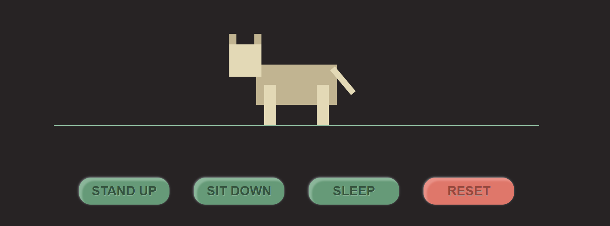

# dog-js
First-year assignment from a web development module.
Control behaviour of the dog with buttons or by clicking on different parts of his body.

🔗 [dog-js.netlify.com](https://dog-js.netlify.com/)

Created with vanilla Javascript, HTML and CSS.
